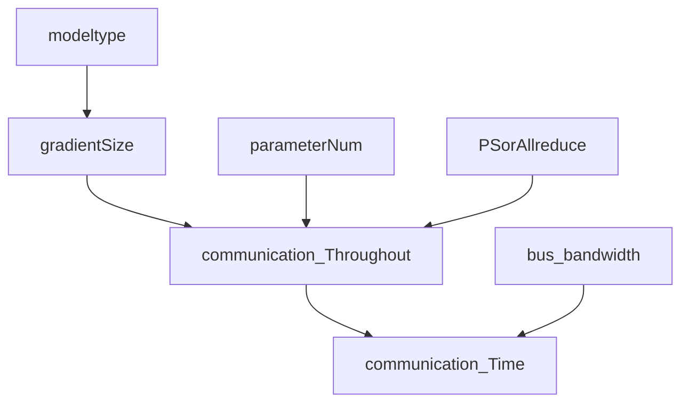

placement的估计

我们知道的是什么?

我们知道模型类型  - > 模型参数大小- > 通信量


我们要求什么? 

speed. 用的时间,  


不同placment主要反映 通信带宽不同,  反应出来就是 gradient  synchronize的时间不一样, 

可以根据model的size , 通信的方式(PS 还是all reduce)    , 网络带宽( intra or inter, PCIE nvlink or 以太网) 

我要查些什么?

PS 通信量是多少? 

allreduce 通信量是多少? 

具体考虑那个带宽? 是整体的带宽还是bottleneck 带宽? 

总结一个通信估计的公式. 

N = the number of node

PS 的通讯时间


all reduce 通讯时间

单机多卡用NVlink2.0,  300GB/s 全双工, 传chunk, 收上一个node的chunk.   所以是2
$$
time = 2*size(θ)*(N-1)/NB \\
size(θ)  = model * 4bytes \\
B = bandwith.
$$
I estimate the influence of differnet placement. 



Firstly, I calculate model size. We only need communicate gradients, one fp32 gradient size is 4 bytes. We multiple it with the number of parameters to gain  communication throughout

model:

["resnet-50",25 millions

 "vgg-16"138 million

, "resnext-110", "inception-bn", "seq2seq", "cnn-text-classification", "dssm", "wlm"]

sync_mode 在DL的trace只有dist_sync一种. 

### 怎么计算model size?

查一查参数大小, 有的可以查到有的查不到. 

之前夏令营的ppt写的, fp16 parameters 是2bytes, gradients是2bytes.

fp32, parameters 4 bytes

gradients 4 bytes

optimizer state : momentum+ variance  8 bytes

那一个参数大概是16bytes. 然后 * 参数个数 是size

但是optimizer state取决于你的方法,不一定是4 bytes

只通信gradients, 那就是4bytes.

"cnn-text-classification",  "dssm", "wlm"]

```python
from keras.applications.resnet50 import ResNet50
resnet_model = ResNet50(weights='imagenet')
#resnet_model.count_params()
resnet_model.summary()
Trainable params: 25,583,592
```

### 网络带宽

PS  到worker是走什么总线? 看硬件,   PS架构的话, PS  是CPU上吗?一般是的,

All reduce , worker到worker是走什么总线? NVLINK2.0.  300GB/s

单机多卡系统可以认为是分布式系统的一种简单特例：卡间通信走 PCIe (或者更加土豪的Nvlink)，要比走以太网(Ethernet)快很多。Nvidia 的 [GPUDirect RDMA](https://link.zhihu.com/?target=https%3A//docs.nvidia.com/cuda/gpudirect-rdma/index.html) 技术让GPU 可以不通过CPU 直接和第三方设备传输数据. 

We compare NVLink 2.0’s ➁ performance to GPU (PCI-e 3.0 ➀) and CPU interconnects (Intel Xeon Ultra Path Interconnect (UPI) ➂, IBM POWER9 X-Bus ➃), CPU memory (Intel Xeon ➄, IBM POWER9 ➅), and GPU memory (Nvidia V100➆).

NVlink2.0 最快, 63GiB 比PCI-e 3.0 要快5-10倍. 

对于 NVlink和 内存, 瓶颈在NVlink. 约


P100搭载的NVLink 1.0，每个P100有4个NVLink通道，每个拥有40GB/s的双向带宽，每个P100可以最大达到160GB/s带宽。nvidia官网上 NVLINK1.0

V100搭载的NVLink 2.0，每个V100,NVLink通道达到6个，每个通道达到50G的双向带宽，因而每个V100可以最大达到300GB/s的带宽。也就是nvidia官网上NVLINK2.0

  ```python
      self.inter_bws = [91.875, 233.0, 59.5, 145.875, 120.125, 60.75, 92.125, 10.375] # MB/s   外部带宽
  ​    self.intra_bws = [306.5, 427.75, 63.0, 1082.125, 181.125, 159.625, 65.625, 22.875] # MB/s 内部带宽  这是机器的, 但是是啥意思呢? 就是每个分配都是不同的机器吗?
  ```


GPU 和GPU 连接用NVlink3.0，600GB/s 。 Nvidia官网可以看到NVLINK3.0. https://www.nvidia.com/en-us/data-center/nvlink/

CPU 和GPU 用 PCIe， 16GB/s. 现在也可以用NVlink2.0 63 GiB/s

CPU和CPU 用QPI   Intel Xeon Ultra Path Interconnect (UPI)和XBUS是 31GiB/s 左右  

网卡 NIC 经过交换机到另一个网卡， 10Gb/s

测出来的速度不代表理论上限

#### ps 总通讯和para size关系?

比如ps 你有几个worker 就是每个worker给ps传一份 那还要乘worker数

一个PS有几个worker呢?  代码论文有说吗?有的, 就是分配worker. 分配完了就知道worker PS的个数了, 然后就知道通信量了 , 除以带宽也就知道. 这里要考虑跨机.   还要知道一个host有几个worker.  超出了就是 跨机了. 

`通信量=  4bytes * 模型梯度个数* worker个数 `

[科普：分布式深度学习系统（二） - 知乎 (zhihu.com)](https://zhuanlan.zhihu.com/p/30976469) 里面有手动计算. 

[腾讯机智团队分享--AllReduce算法的前世今生 - 知乎 (zhihu.com)](https://zhuanlan.zhihu.com/p/79030485)有公式
$$
PS recv的size = PS send的size  =   gradient的size* 负责的worker数 \\
parameter数 =  gradient数\\
完美带宽need = (PS recv +PS send)的size  /计算的时间也就是iteration的时间
$$

- 先考虑PS的客户端。为了保证参数的同步，每个计算节点在每个iteration计算结束后，要先把这61.5M个梯度值发出去，再从PS收回61.5M个值，作为更新后的参数 ![[公式]](https://www.zhihu.com/equation?tex=%7B%5Clarge+%5Ctheta%5E%7B%28t%2B1%29%7D%7D) 
- 再考虑服务器端：每个iteration内，服务器端得收61.5M * 8 = 492M个梯度回来，把这些梯度加到 ![[公式]](https://www.zhihu.com/equation?tex=%7B%5Clarge+%5Ctheta%5E%7B%28t%29%7D%7D) 上得到 ![[公式]](https://www.zhihu.com/equation?tex=%7B%5Clarge+%5Ctheta%5E%7B%28t%2B1%29%7D%7D) ，再把 ![[公式]](https://www.zhihu.com/equation?tex=%7B%5Clarge+%5Ctheta%5E%7B%28t%2B1%29%7D%7D) 分别发给每个计算节点，也就是再往外发送61.5M * 8 = 492M个参数出去。

### allreduce总通讯和para size关系?

ring-allreduce ,allreduce也有个公式  ,好像是# para_size * 2*n/（n-1）, n是# worker,这个说的是单个worker的通讯量,也不是整体的

allreduce，每个 node 都从其他 node 上面收集参数，同时对收集到的参数进行归并。

可以让机器当PS同时当计算节点. 每台物理节点，作为服务器需要收一次发一次，而同时作为计算节点需要发一次收一次也就是4次. 如果总共有8台机器, 每台带宽就是:
$$
每秒传输= 4 × gradient的size/iteration的时间 × 7/8
$$


### allreduce通讯时间怎么计算?

因为allreduce是同时发生的 所以看最慢的那个worker的通讯时间就可以

在单机多卡的场景中，由于 PCIe 是全双工的(可以同时收发)，所以数据传输的耗时只有 ![[公式]](https://www.zhihu.com/equation?tex=%5Cfrac%7B%28N-1%29%7D%7BNB%7D+%5Ctextrm%7Bsize%7D%28%5Ctheta%29) , 其中 ![[公式]](https://www.zhihu.com/equation?tex=B) 是 PCIe 设备传输的带宽.


怎么建模通讯时间?

https://core.ac.uk/download/pdf/157810919.pdf 论文里有图. 

同一个机器的GPU-GPU走nvilink( 假设inner server GPU都是互联,其实可能有的GPU不互联) CPU-GPU走pcie, 跨机器就是以太网, 

可以尝试就按这个最简单的模型建模communication


NUMA :浅解NUMA机制 - 柴可夫斯猫的文章 - 知乎 https://zhuanlan.zhihu.com/p/67558970每个node 有独立的内存器件.

UMA(Uniform Memory Access)，直译为“统一内存访问”，这样的架构对软件层面来说非常容易，总线模型保证所有的内存访问是一致的，即**每个处理器核心共享相同的内存地址空间**。但随着CPU核心数的增加，这样的架构难免遇到问题，比如对总线的带宽带来挑战、访问同一块内存的冲突问题。

