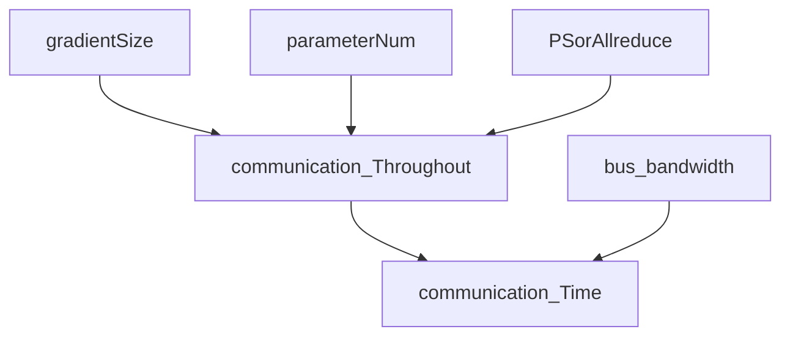

placement的估计


不同placment主要反映 通信带宽不同,  反应出来就是 gradient  synchronize的时间不一样, 

可以根据model的size , 通信的方式(PS 还是all reduce)    , 网络带宽( intra or inter, PCIE nvlink or 以太网) 

我要查些什么?

PS 通信量是多少? 

allreduce 通信量是多少? 

具体考虑那个带宽? 是整体的带宽还是bottleneck 带宽? 

总结一个通信估计的公式. 


I estimate the influence of differnet placement. 


```mermaid
graph 
gradientSize --> communication_Throughout
parameterNum --> communication_Throughout
PSorAllreduce --> communication_Throughout
communication_Throughout --> communication_Time
bus_bandwidth--> communication_Time
```

Firstly, I calculate model size. We only need communicate gradients, one fp32 gradient size is 4 bytes. We multiple it with the number of parameters to gain  communication throughout

model:

["resnet-50",25 millions

 "vgg-16"138 million

, "resnext-110", "inception-bn", "seq2seq", "cnn-text-classification", "dssm", "wlm"]

sync_mode 在DL的trace只有dist_sync一种. 

### 怎么计算model size?

fp16 parameters 是2bytes, gradients是2bytes.

fp32, parameters 4 bytes

gradients 4 bytes

optimizer state : momentum+ variance  8 bytes

那一个参数大概是16bytes. 然后 * 参数个数 是size

但是optimizer state取决于你的方法,不一定是4 bytes

只通信gradients, 那就是4bytes.


### 网络带宽

单机多卡系统可以认为是分布式系统的一种简单特例：卡间通信走 PCIe (或者更加土豪的Nvlink)，要比走以太网(Ethernet)快很多。Nvidia 的 [GPUDirect RDMA](https://link.zhihu.com/?target=https%3A//docs.nvidia.com/cuda/gpudirect-rdma/index.html) 技术.

We compare NVLink 2.0’s ➁ performance to GPU (PCI-e 3.0 ➀) and CPU interconnects (Intel Xeon Ultra Path Interconnect (UPI) ➂, IBM POWER9 X-Bus ➃), CPU memory (Intel Xeon ➄, IBM POWER9 ➅), and GPU memory (Nvidia V100➆).

PCI 

NVlink2.0 最快, 63GiB 比PCI-e 3.0 要快5-10倍. 

对于 NVlink和 内存, 瓶颈在NVlink. 约


P100搭载的NVLink 1.0，每个P100有4个NVLink通道，每个拥有40GB/s的双向带宽，每个P100可以最大达到160GB/s带宽。nvidia官网上 NVLINK1.0

V100搭载的NVLink 2.0，每个V100,NVLink通道达到6个，每个通道达到50G的双向带宽，因而每个V100可以最大达到300GB/s的带宽。也就是nvidia官网上NVLINK2.0

  ```python
      self.inter_bws = [91.875, 233.0, 59.5, 145.875, 120.125, 60.75, 92.125, 10.375] # MB/s   外部带宽
  ​    self.intra_bws = [306.5, 427.75, 63.0, 1082.125, 181.125, 159.625, 65.625, 22.875] # MB/s 内部带宽
  ```


GPU 和GPU 连接用NVlink3.0，600GB/s 。 Nvidia官网可以看到NVLINK3.0. https://www.nvidia.com/en-us/data-center/nvlink/

CPU 和GPU 用 PCIe， 16GB/s

CPU和CPU 用QPI

网卡 NIC 经过交换机到另一个网卡， 10Gb/s

测出来的速度不代表理论上限


#### ps 总通讯和para size关系?

比如ps 你有几个worker 就是每个worker给ps传一份 那还要乘worker数字


`通信量=  4bytes * 模型梯度个数* worker个数 `

[科普：分布式深度学习系统（二） - 知乎 (zhihu.com)](https://zhuanlan.zhihu.com/p/30976469) 里面有手动计算. 

[腾讯机智团队分享--AllReduce算法的前世今生 - 知乎 (zhihu.com)](https://zhuanlan.zhihu.com/p/79030485)有公式
$$
PS recv的size = PS send的size  =   gradient的size* 负责的worker数 \\
parameter数 =  gradient数\\
带宽need = (PS recv +PS send)的size  /计算的时间也就是iteration的时间
$$

- 先考虑PS的客户端。为了保证参数的同步，每个计算节点在每个iteration计算结束后，要先把这61.5M个梯度值发出去，再从PS收回61.5M个值，作为更新后的参数 ![[公式]](https://www.zhihu.com/equation?tex=%7B%5Clarge+%5Ctheta%5E%7B%28t%2B1%29%7D%7D) 。
- 再考虑服务器端：每个iteration内，服务器端得收61.5M * 8 = 492M个梯度回来，把这些梯度加到 ![[公式]](https://www.zhihu.com/equation?tex=%7B%5Clarge+%5Ctheta%5E%7B%28t%29%7D%7D) 上得到 ![[公式]](https://www.zhihu.com/equation?tex=%7B%5Clarge+%5Ctheta%5E%7B%28t%2B1%29%7D%7D) ，再把 ![[公式]](https://www.zhihu.com/equation?tex=%7B%5Clarge+%5Ctheta%5E%7B%28t%2B1%29%7D%7D) 分别发给每个计算节点，也就是再往外发送61.5M * 8 = 492M个参数出去。

### allreduce总通讯和para size关系?

allreduce也有个公式  ,好像是# para_size * 2*n/（n-1）, n是# worker,这个说的是单个worker的通讯量,也不是整体的

allreduce，每个 node 都从其他 node 上面收集参数，同时对收集到的参数进行归并。

可以让机器当PS同时当计算节点. 每台物理节点，作为服务器需要收一次发一次，而同时作为计算节点需要发一次收一次也就是4次. 如果总共有8台机器, 每台带宽就是:
$$
每秒传输= 4 × gradient的size/iteration的时间 × 7/8
$$
ring-allreduce 

### allreduce通讯时间怎么计算?

因为allreduce是同时发生的 所以看最慢的那个worker的通讯时间就可以

