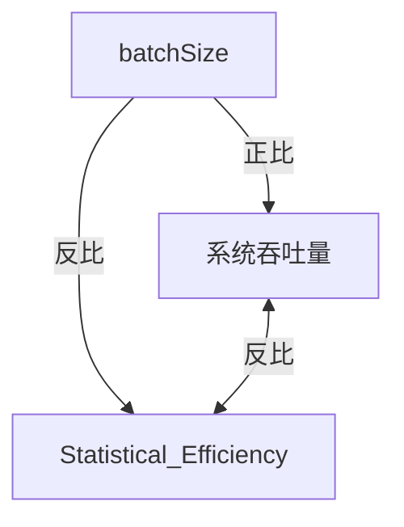

pollux

### Pollux: Co-adaptive Cluster Scheduling for Goodput-Optimized Deep Learning osdi2021

[pdf](https://arxiv.org/pdf/2008.12260.pdf)    [code](https://github.com/petuum/adaptdl)   [slides](https://www.usenix.org/system/files/osdi21_slides_qiao.pdf)

#### motivation

GPU多了就不会提升训练速度.统计表明 batch size 过大, 需要的step会变多.  而且模型泛化性变差. 但是最优的batch size 不是不变的, 训练时还会改变. 

batch size  取决于 scalablity和 statistical efficiency统计效率. 统计效率通常和throughput 成反比. 

目前的调度器选了资源, 但是对batch size和学习率没有相应调整. 这些超参数还和资源互相依赖.    

How can a cluster scheduler help to automatically configure user-submitted DL jobs?

#### contribution

考虑了多个job,在训练期间监控每个作业的状态，Pollux 模拟了它们的 Goodput（我们引入的将系统吞吐量与statistical efficiency相结合的指标）将如何通过adding or removing资源而改变。  Pollux 动态(重新)assign资源以提高cluster-wide的goodput，同时尊重公平性并不断优化每个 DL 作业以更好地利用这些资源.

吞吐量:=单位时间训练样本数. 受资源分配和placement的影响, 受同步或者异步影响 , 受batch size 影响

统计效率 :=单位样本数取得的训练进展,这受超参数比如学习率和batch size 有关.如果统计效率预测的准,及时调整就可以提高统计效率

建模了吞吐量, 让他可以确定 资源的数量和batch size,  

#### weakness

她没有考虑device placement

#### idea

现有的调度器对 DL 训练的统计效率以及资源决策和训练参数的相互依赖性是不可知的。  Pollux 明确地共同调整这些相互依赖的值，以提高 DL 作业的吞吐量. 目前我们对resource allocation和 placement也是不可知的, 所以我们需要共同调整. 

他是怎么共同调整的?

两个粒度, job 粒度 和cluster粒度.  pollux agent 拟合效率和吞吐量,  报告给scheduler, scheduler 定期根据每个job和总体cluster优化资源分配 . 也考虑了重分配的网络开销.  每个job的agent 报告goodputs, scheduler 动态分配资源. 

遗传算法. 来调整策略. 我们可不可以用DRL?  

怎么测量goodput?  replica

怎么预测goodput?  用一个方程来估计效率.

怎么配合job的colocation 和单个job的performance?

第二层的决策怎么给第一层一些影响?怎么设计一个function,作为我们drl的目标,可以jointly的平衡这两个问题single job performance & cluster performance?

### 摘要

有的叫用户提交资源, 

有的帮用户选, 但是没有 优化资源利用.

pollux 都有. 

### 3 The Goodput ofDLTraining and Pollux

#### 3.1 Modeling Statistical Efficiency

定义了EFFICIENCY,是 0到1之间的一个数值， 定义了不同batch size之间的训练效率区别。 用等式6来预测EFFICIENCY。
figure2 测了各个模型的EFFICIENCY，上面一行展示了validation，但是感觉也没啥用。 中间一行有啥用？好像是说efficiency这个具有代表性,证明larger batch sizes have lower EFFICIENCY early in training.  下面一行是证明预测的和实际上的很接近。   

推荐系统和bert微调， batch size 大不一定efficiency低。

#### 3.2 Modeling System Throughput

他们预测每个iter的时间，预测吞吐量。 
figure3 证明， 不同GPU和不同batch size， model都建模的很好。  他用nccl和pytorch 实际测了。 

### 4 Pollux Design and Architecture

scheduler的工作: 定期分配资源给每个job, 考虑agent tune的能力, 

job agent的工作:  调整超参数

​    Pollux 在两个不同的粒度上调整 DL 作业执行。 首先，给每个job 动态调整batch size和学习率，以实现分配资源的最佳利用。 其次，整个集群动态（重新）分配资源， driven by 共享集群的所有作业的googput以及包括公平性和作业完成时间在内的集群级目标。

​     首先，一个 PolluxAgent 与每个作业一起运行。 它fit该作业的 EFFICIENCYt 和 THROUGHPUT 函数，并调整其batch size和学习率以实现高效利用其当前分配的资源。  PolluxAgent 定期向 PolluxSched 报告其作业的goodput函数。 

​       其次，PolluxSched 会定期优化集群中所有作业的资源分配，同时考虑每个作业的当前吞吐量函数和集群范围的资源争用情况。  PolluxSched 做出的调度决策还考虑了与资源重新分配相关的开销、由于多个作业之间的网络干扰导致的速度减慢以及资源公平性。  	

​    PolluxAgent 和 PolluxSched 相互适应。  当 PolluxAgent 调整每个训练作业以有效利用其分配的资源时，PolluxSched 动态地重新分配每个作业的资源，同时考虑到 PolluxAgent 调整其作业的能力。

( 这一步很关键, 可以思考DRL 怎么做出第一个决策后让第二个动态重新分配？)

#### 4.1 PolluxAgent: Job-level Optimization

job开始就启动agent. 每个训练作业都会启动一个 PolluxAgent 实例。 在训练期间，它会不断测量作业的梯度噪声规模和系统吞吐量，并以固定的时间间隔将它们报告给PolluxSched。 在给定当前资源分配的情况下，它还使用此信息来确定其作业的最有效batch size，并使用适当的plug-in LR缩放规则使其作业的学习率适应此batch size（例如，对于SGD 用 AdaScale ）

agent做些什么? gradient noise scale 和吞吐量 , 定期报告.  调整学习率和batch size. 

##### Online model fitting.

讲了建模的具体一些变量.

PolluxAgent 测量每次迭代所用的时间 Titer，并记录其生命周期中遇到的资源分配 a、每 GPU batch size m 和梯度累积步骤 s 的所有组合的元组 (a,m,s,Titer)

PolluxAgent 定期将参数 θsys 拟合到迄今为止收集的所有吞吐量数据。 具体来说，我们最小化方程之间的均方根对数误差（RMSLE）和收集的数据三元组，使用 L-BFGS-B [73]。 我们将每个 α 和 β 参数的约束设置为非负值，并将 γ 设置在 [1,10] 范围内。 

然后 PolluxAgent 将更新后的 θsys 和 ϕt 值报告给 PolluxSched。

##### Prior-driven exploration

在一开始用一些先验知识来设置. 

##### Training job tuning. 

 使用 θsys、ϕt 和 M0，它们完全指定了 DL 作业在其当前训练进度中的 GOODPUT 函数，PolluxAgent 确定最有效的 per-GPU 批量大小和梯度累积步骤，(m∗, s∗)=argmax GOODPUT(a,m  ,s), m,s (13) 其中 a 是作业的当前资源分配。 

agent找到最好的batch size和 gradient accumulation steps

怎么找的?    就是根据这个函数.

一旦找到新的配置，作业将使用它进行后续的训练迭代，使用plug-in LR 缩放规则来适当地调整其学习率。 随着作业的 EFFICIENC Yt 函数随时间变化，PolluxAgent 将定期重新评估最有效的配置。

### 4.2 PolluxSched: Cluster-wide Optimization

我们可不可让Sched DRL来?感觉应该就是 agent 提交, 然后 怎么让agent调整placement? 我想不出来

PolluxSched 定期为集群中的每个作业分配（和重新分配）资源。 为了确定一组有效的集群范围资源分配.PolluxSched最大化适应度函数(遗传算法)，该函数被定义为每个作业加速的广义（功率）平均值：

A 是一个分配矩阵，每行 Aj 是作业 j 的分配向量，因此 Ajn 是节点 n 上分配给作业 j 的 GPU 数量，J 是共享集群的正在运行和待处理的作业总数。 我们将每个工作的加速定义为the factor of goodput improvement using a given resource allocation over using a fair-resource allocation, ie.   给定资源的goodput / 公平分配的goodput.

其中 GOODPUT j 是作业 j 在当前训练迭代中的输出量，af 是作业的公平资源分配，定义为集群的独占 1/J 份额。

​ 在第 3 节中，我们描述了 GOODPUT 函数如何在训练期间拟合观察到的指标，然后作为预测模型进行评估。  PolluxSched 利用这种能力来预测 GOODPUT，通过搜索过程最大化 FITNESS，然后将输出的分配应用于集群。 

**公平性和效果 p**。 当 p = 1 时，FITNESS p 是所有作业的 SPEEDUP 值的平均值。 这会导致 PolluxSched 将更多 GPU 分配给在提供许多 GPU 时实现高 SPEEDUP 的作业（即可扩展的作业）p = -1时比较公平. 

**Re-allocation penalty.**

 每次将作业重新分配到不同的 GPU 集时，都会产生一些延迟来重新配置训练过程。 使用流行的检查点重启方法，我们测量了 15 到 120 秒的延迟，具体取决于正在训练的模型的大小和训练代码中的其他初始化任务。 为了防止过多的重新分配，当 PolluxSched 评估给定分配矩阵的适应度函数时，它会对每个需要重新分配的工作进行惩罚.我们定义 REALLOC_FACTORj(δ) = (Tj − Rjδ)/(Tj + δ)，其中 Tj 是训练作业的age，Rj 是迄今为止作业产生的重新分配次数，δ 是对 重新分配延迟。 直观地说，REALLOC_FACTORj(δ)  缩放 SPEEDUPj(Aj), 假设任务 j 的历史平均重新分配率将无限期地持续到未来。 因此，历史上重新分配率较高的工作将因未来的重新分配而受到更多惩罚。

**Interference avoidance**

When multiple distributed DL jobs share a single node, their network usage while synchronizing gradients and model parameters may interfere with each other, causing both jobs to slow down [31]; Xiao et al. [66] report up to 50% slowdown for DL jobs which compete with each other for network resources. PolluxSched mitigates this issue by disallowing different distributed jobs (each using GPUs across multiple nodes) from sharing the same node. （因为网卡带宽不够，但是或许可以用rdma smartNIC啥的来帮助？）

### 4.3 Implementation

pollux agent:

1. measure:  the time taken for each iteration of training 测量速度
2.   calculating the gradient noise scale. 计算 梯度噪声
3. fits the system throughput model  to the profiled metrics collected  拟合吞吐量模型和最新的梯度统计数据.
4.  reports the fitted system throughput parameters, along with the latest gradient statistics, to PolluxSched.  报告吞吐量参数
5.  After reporting to PolluxSched, PolluxAgent updates the job’s per-GPU batch size and gradient accumulation steps, by optimizing its now up-to-date goodput function with its currently allocated resources.  调整自己的job, 

PolluxSched 在 Kubernetes [2] 中作为服务实现。
   在固定的时间间隔内，PolluxSched 运行其搜索算法，然后通过创建和终止运行作业 worker 的 Kubernetes Pod 来应用结果分配矩阵。 为了找到一个好的分配矩阵，PolluxSched 使用了基于种群的搜索算法（遗传算法），该算法对候选分配矩阵进行扰动和组合以产生更高值的分配矩阵，最后对其进行修改以满足节点资源约束和干扰避免。 具有最高适应度分数的分配矩阵应用于集群中运行的作业。  PolluxAgent 和 PolluxSched 都需要一个子过程来优化 GOODPUTt(a,m, s) 给定一个固定的 a（方程 13）。 我们通过首先对总batch size M 的一系列候选值进行采样，然后根据用户定义的上限找到最小的 s，使得 m = M/s 适合 GPU 内存，并最终取 导致最高 GOODPUT 值的配置。

