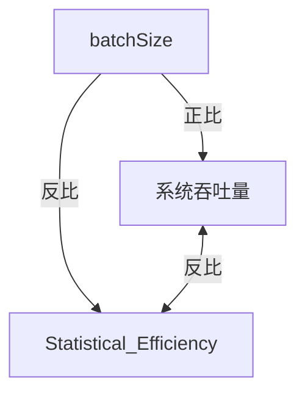

pollux

### Pollux: Co-adaptive Cluster Scheduling for Goodput-Optimized Deep Learning osdi2021

[pdf](https://arxiv.org/pdf/2008.12260.pdf)    [code](https://github.com/petuum/adaptdl)   [slides](https://www.usenix.org/system/files/osdi21_slides_qiao.pdf)

#### motivation

GPU多了就不会提升训练速度.统计表明 batch size 过大, 需要的step会变多.  而且模型泛化性变差. 但是最优的batch size 不是不变的, 训练时还会改变. 

batch size  取决于 scalablity和 statistical efficiency统计效率. 统计效率通常和throughput 成反比. 

目前的调度器选了资源, 但是对batch size和学习率没有相应调整. 这些超参数还和资源互相依赖.    

How can a cluster scheduler help to automatically configure user-submitted DL jobs?

```mermaid
graph
batchSize --正比-->系统吞吐量
batchSize --反比-->Statistical_Efficiency
系统吞吐量 <--反比-->Statistical_Efficiency
```

#### contribution

考虑了多个job,在训练期间监控每个作业的状态，Pollux 模拟了它们的 Goodput（我们引入的将系统吞吐量与statistical efficiency相结合的指标）将如何通过adding or removing资源而改变。  Pollux 动态(重新)assign资源以提高cluster-wide的goodput，同时尊重公平性并不断优化每个 DL 作业以更好地利用这些资源.

吞吐量:=单位时间训练样本数. 受资源分配和placement的影响, 受同步或者异步影响 , 受batch size 影响

统计效率 :=单位样本数取得的训练进展,这受超参数比如学习率和batch size 有关.如果统计效率预测的准,及时调整就可以提高统计效率

建模了吞吐量, 让他可以确定 资源的数量和batch size,  

#### weakness

她没有考虑device placement

#### idea

现有的调度器对 DL 训练的统计效率以及资源决策和训练参数的相互依赖性是不可知的。  Pollux 明确地共同调整这些相互依赖的值，以提高 DL 作业的吞吐量. 目前我们对resource allocation和 placement也是不可知的, 所以我们需要共同调整. 

他是怎么共同调整的?

两个粒度, job 粒度 和cluster粒度.  pollux agent 拟合效率和吞吐量,  报告给scheduler, scheduler 定期根据每个job和总体cluster优化资源分配 . 也考虑了重分配的网络开销.  每个job的agent 报告goodputs, scheduler 动态分配资源. 

遗传算法. 来调整策略. 我们可不可以用DRL?

怎么测量goodput?  replica

怎么预测goodput?  用一个方程来估计效率.

怎么配合job的colocation 和单个job的performance?

第二层的决策怎么给第一层一些影响?怎么设计一个function,作为我们drl的目标,可以jointly的平衡这两个问题single job performance & cluster performance?

### 摘要

有的叫用户提交资源, 

有的帮用户选, 但是没有 优化资源利用.

pollux 都有. 

### 3 The Goodput ofDLTraining and Pollux

#### 3.1 Modeling Statistical Efficiency

#### 3.2 Modeling System Throughput

### 4 Pollux Design and Architecture

scheduler的工作: 定期分配资源给每个job, 考虑agent tune的能力, 

job agent的工作:  调整超参数, 

Pollux adapts DL job execution at two distinct granularities. First, at a job-level granularity, Pollux dynamically tunes the batch size and learning rate for best utilization of the allocated resources. Second, at the cluster-wide granularity, Pollux dynamically (re-)allocates resources, driven by the goodput of all jobs sharing the cluster combined with cluster-level goals including fairness and job-completion time. To achieve this co-adaptivity in a scalable way, Pollux’s design consists of two primary components, as illustrated in Fig. 4. First, a PolluxAgent runs together with each job. It fits the EFFICIENCYt and THROUGHPUT functions for that job, and tunes its batch size and learning rate for efficient utilization

​    Pollux 在两个不同的粒度上调整 DL 作业执行。 首先，在作业级别的粒度上，Pollux 动态调整批量大小和学习率，以实现分配资源的最佳利用。 其次，在集群范围的粒度上，Pollux 动态（重新）分配资源，由共享集群的所有作业的吞吐量以及包括公平性和作业完成时间在内的集群级目标驱动。 为了以可扩展的方式实现这种协同适应性，Pollux 的设计由两个主要组件组成，如图 4 所示。

​     首先，一个 PolluxAgent 与每个作业一起运行。 它适合该作业的 EFFICIENCYt 和 THROUGHPUT 函数，并调整其批量大小和学习率以实现高效利用其当前分配的资源。  PolluxAgent 定期向 PolluxSched 报告其作业的吞吐量函数。 

​       其次，PolluxSched 会定期优化集群中所有作业的资源分配，同时考虑每个作业的当前吞吐量函数和集群范围的资源争用情况。  PolluxSched 做出的调度决策还考虑了与资源重新分配相关的开销、由于多个作业之间的网络干扰导致的速度减慢以及资源公平性。  	

​    PolluxAgent 和 PolluxSched 相互适应。   当 PolluxAgent 调整每个训练作业以有效利用其分配的资源时，PolluxSched 动态地重新分配每个作业的资源，同时考虑到 PolluxAgent 调整其作业的能力。

of its current allocated resources. PolluxAgent periodically reports the goodput function of its job to the PolluxSched. Second, the PolluxSched periodically optimizes the resource allocations for all jobs in the cluster, taking into account the current goodput function for each job and cluster-wide resource contention. Scheduling decisions made by PolluxSched also account for the overhead associated with resource re-allocations, slowdowns due to network interference between multiple jobs, and resource fairness. PolluxAgent and PolluxSched co-adapt to each other.
While PolluxAgent adapts each training job to make efficient use of its allocated resources, PolluxSched dynamically re-allocates each job’s resources, taking into account the PolluxAgent’s ability to tune its job.

#### 4.1 PolluxAgent: Job-level Optimization

job开始就启动agent. 每个训练作业都会启动一个 PolluxAgent 实例。 在训练期间，它会不断测量作业的梯度噪声规模和系统吞吐量，并以固定的时间间隔将它们报告给 PolluxSched。 在给定当前资源分配的情况下，它还使用此信息来确定其作业的最有效批量大小，并使用适当的插件 LR 缩放规则使其作业的学习率适应此批量大小（例如，用于 SGD 的 AdaScale ）。

agent做些什么? gradient noise scale 和吞吐量 , 定期报告.  调整学习率和batch size . 

##### Online model fitting.

讲了建模的具体一些变量.

PolluxAgent 测量每次迭代所用的时间 Titer，并记录其生命周期中遇到的资源分配 a、每 GPU 批量大小 m 和梯度累积步骤 s 的所有组合的元组 (a,m,s,Titer)。  

PolluxAgent 定期将参数 θsys 拟合到迄今为止收集的所有吞吐量数据。 具体来说，我们最小化方程之间的均方根对数误差（RMSLE）。  11 和收集的数据三元组，使用 L-BFGS-B [73]。 我们将每个 α 和 β 参数的约束设置为非负值，并将 γ 设置在 [1,10] 范围内。 

然后 PolluxAgent 将更新后的 θsys 和 ϕt 值报告给 PolluxSched。

##### Prior-driven exploration

在一开始用一些先验知识来设置. 

##### Training job tuning. 

agent找到最好的batch size和 gradient accumulation steps

一旦找到新的配置，作业将使用它进行后续的训练迭代，使用插件 LR 缩放规则来适当地调整其学习率。 随着作业的 EFFICIENCYt 函数随时间变化，PolluxAgent 将定期重新评估最有效的配置。

### 4.2 PolluxSched: Cluster-wide Optimization

我们可不可让Sched DRL来?

PolluxSched 定期为集群中的每个作业分配（和重新分配）资源。 为了确定一组有效的集群范围资源分配

PolluxSched最大化适应度函数(遗传算法)，该函数被定义为每个作业加速的广义（功率）平均值：

其中 GOODPUTj 是作业 j 在当前训练迭代中的输出量，af 是作业的公平资源分配，定义为集群的独占 1/J 份额。

​    在第 3 节中，我们描述了 GOODPUT 函数如何 在训练期间拟合观察到的指标，然后作为预测模型进行评估。  PolluxSched 利用这种能力来预测 GOODPUT，通过搜索过程最大化 FITNESS，然后将输出的分配应用于集群。 公平性和效果 p。 当 p = 1 时，FITNESSp 是所有作业的 SPEEDUP 值的平均值。 这会导致 PolluxSched 将更多 GPU 分配给在提供许多 GPU 时实现高 SPEEDUP 的作业（即可扩展的作业）

p = -1时比较公平. 

#### Re-allocation penalty.

 每次将作业重新分配到不同的 GPU 集时，都会产生一些延迟来重新配置训练过程。 使用流行的检查点重启方法，我们测量了 15 到 120 秒的延迟，具体取决于正在训练的模型的大小和训练代码中的其他初始化任务。 为了防止过多的重新分配，当 PolluxSched 评估给定分配矩阵的适应度函数时，它会对每个需要重新分配的工作进行惩罚，

我们定义 REALLOC_FACTORj(δ) = (Tj − Rjδ)/(Tj + δ)，其中 Tj 是训练作业的年龄，Rj 是迄今为止作业产生的重新分配次数，δ 是对 重新分配延迟。 直观地说，REALLOC_FACTORj(δ)  缩放 SPEEDUPj(Aj), 假设任务 j 的历史平均重新分配率将无限期地持续到未来。 因此，历史上重新分配率较高的工作将因未来的重新分配而受到更多惩罚。

#### Interference avoidance

. When multiple distributed DL jobs share a single node, their network usage while synchronizing gradients and model parameters may interfere with each other, causing both jobs to slow down [31]; Xiao et al. [66] report up to 50% slowdown for DL jobs which compete with each other for network resources. PolluxSched mitigates this issue by disallowing different distributed jobs (each using GPUs across multiple nodes) from sharing the same node. (他是直接禁止两个job共享节点, 我们可以共享?  但是很难, 不好改.而且很奇怪, 图4明明共享了节点. 哦可能是同一种job )

