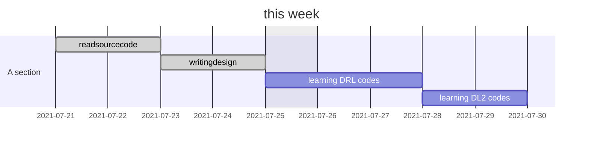

week report 21 July

## Summary:

### Progress:

1. I have written the idea1 steps.
2. I have read the source codes of DL2 and some other DRL codes. (不要read一个大的, 要自己编写一个小的.)

3. I have read some RL methods to solve reward sparse problems.

4. I am writting motivation and background.

  DL2  could  resources  allocation,  but  it  still  use  default placement  policy  in  its  work,  the  placement  of  workers  and PSs can  potentially be decided  by RL  too. Using one  NN to produce  both  resource  allocation  and  placement  decisions  is challenging, mainly because of the significantly larger action space.  RL  using  a  hierarchical  NN  model  might  be  useful in  making  resource  allocation  and  placement  decisions  in  a hierarchical fashion.

  Deep Reinforcement Learning, DRL has played an important role on game AI because games have concrete rewards. On the contrary, there are few rewards, few network update signals and sample inefficiency in practical applications. It is not so easy for agents to know all the elements in Markov Decision Process. Usually, the state transition function and reward function are difficult to estimate, and even the state in the environment may be unknown. At this time, model free learning is needed. Model free learning does not model the real environment. The agent can only perform actions through certain strategies in the real environment, wait for rewards and state migration, and then update the behavior strategy according to these feedback information. In this way, it iterates repeatedly until the optimal strategy is learned.

Mirhoseini etc\cite{mirhoseini2017device} uses a recurrent neural network policy network to predict the placement of operations in a computational graph, hierarchical model \cite{mirhoseini_hierarchical_2018} could efficiently place computational graphs onto hardware devices, especially in heterogeneous environments with a mixture of CPUs, GPUs, and other computational devices. It is based on data-flow instead of parameter server architecture. However, it cannot solve the following problems: 

{resource allocation} It still use the resources (PS/worker) allocated by TensorFlow or job owner, which are less efficient or not general enough.   

{multiple jobs}  The planner can only optimizes the training time for a target model (e.g., a TensorFlow graph) If we meet another model, we need retrain this planner. Further, the modeling typically does not consider interference in a multi-tenant cluster.  On the contrary, harmony can find the efficient placement of different type of jobs. It is more generic and efficient. 

## day by day

7.21 

1. I have read "hierarchical planner", which allocates operations to each group, then places each group to devices. Different from allocating PS, the PS in the hierarchical planner are automatically allocated by TensorFlow. 

7.22

I read the source code of DL2, read the specific codes of online reinforcement learning and supervised learning.

7.23

Progress

1. I am writing the input and output of the first level, I think hierarchical could use one reward. 
2.  I read some hierarchical DRL papers, summary their rewards, input, and output.

Problem:

I need a GPU to train first-level NN. Maybe I could apply for GPU from HKU.

7.24

I am still writing my idea about hierarchical design. My first idea is combining DL2 with harmony, they have many similarities while having many differences. 

Problem

1. Dl2 has only allocated worker/PS to the job but doesn't allocate GPU/CPU resource demand, such as CPU and GPU. I want to ask for some relevant literature about allocating CPU/GPU. Whether or not it is allocated by the job owner? Dr. Peng told me that it is fixed at first to simplify problems.
2. Harmony's paper, input state, vector w(p) illustrates the number of PS/workers. Is it the same with this repeated with matrix Rn above?

7.25

Progress

1. I have asked Dr. Peng, he told me that each worker has a fixed number of  CPU/GPU. He fixed the number to simplify the problems.
2. I draw the diagram for hierarchical design.

7.26

Progress

I summary the reward design from different papers. I am learning the policy gradient algorithm.

7.27

I experiment the codes which mentioned by Yixin Bao. I am learning the policy gradient and DRL framework.

(感觉跑一跑学不到什么, 得自己写一遍或者加一些功能或者改一改功能才行. 改参数也学不会.  )

7.28

I have read "the Device Placement Optimization with Reinforcement Learning". I want to figure out how it turn one model to hierarchical model "A HIERARCHICAL MODEL FOR DEVICE PLACEMENT2018". This hierarchical model could automatically assign ops to groups for avoiding vanishing and exploding gradient issues.

