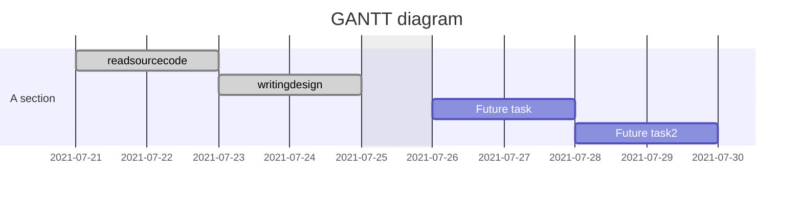

week report 21 July

## Summary:

### Problem

### Progress:

```mermaid
gantt
dateFormat  YYYY-MM-DD
title GANTT diagram 
excludes weekdays 2021-07-25

section A section
readsourcecode        :done,   des1,  2021-07-21,2021-07-23
writingdesign               :done, des2,  2021-07-23, 2d
Future task            :         des3, after des2, 2d
Future task2         :         des4, after des3, 2d

```

## day by day

7.21 
1. I have read "hierarchical planner", which allocates operations to each group, then places each group to devices. Different from allocating PS, the PS in the hierarchical planner are automatically allocated by TensorFlow. 

7.22

1. I read the source code of DL2, read the specific codes of online reinforcement learning and supervised learning.

7.23

Progress

1. I am writing the input and output of the first level, I think hierarchical could use one reward. 
2.  I read some hierarchical DRL papers, summary their rewards, input, and output.

Problem:

1. I need a GPU to train first-level NN. Maybe I could apply for GPU from HKU.

7.24

1. I am still writing my idea about hierarchical design. My first idea is combining DL2 with harmony, they have many similarities while having many differences. 

Problem

1. Dl2 has only allocated worker/PS to the job but doesn't allocate GPU/CPU resource demand, such as CPU and GPU. I want to ask for some relevant literature about allocating CPU/GPU. Whether or not it is allocated by the job owner? Dr. Peng told me that it is fixed at first to simplify problems.
2. Harmony's paper, input state, vector w(p) illustrates the number of PS/workers. Is it the same with this repeated with matrix Rn above?
3. 

7.25

Progress

1. I have asked Dr. Peng, he told me that each worker has a fixed number of  CPU/GPU. He fixed the number to simplify the problems.

