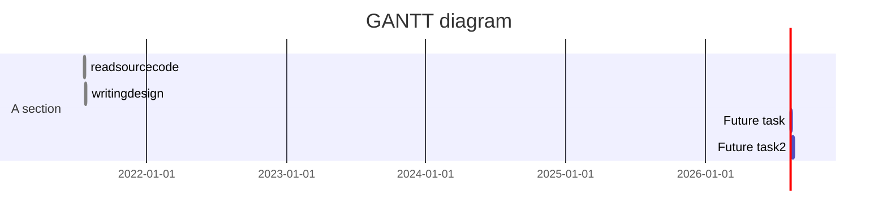

week report 21 July

7.21 

1. I have read "hierarchical planner", it allocate operations to each group, then place each group to devices. Different from allocating PS, the PS in hierarchical planner are automatically allocated by TensorFlow. 

7.22

1. I read the source code of DL2, read the specific codes of online reinforcement learning and supervised learning.

7.23

Progress

1. I am writing the input and output of first level, I think hierarchical could use one reward. 
2.  I read  some hierarchical DRL papers, summary their rewards, input and output.

```mermaid
gantt
dateFormat  YYYY-MM-DD
title GANTT diagram 
excludes weekdays 2021-07-23

section A section
readsourcecode        :done,     2021-07-21,2021-07-23
writingdesign               :done,   2021-07-24, 3d
Future task            :         des3, after des2, 5d
Future task2         :         des4, after des3, 5d

```

Problem:

1. I need a GPU to train first level NN. Maybe I could apply GPU from hku.

