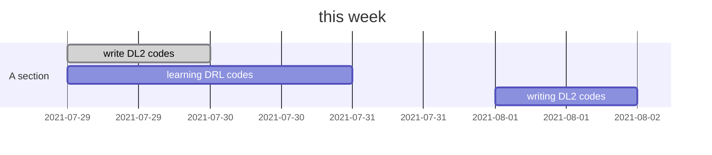

week report 29-08.04

## Summary:

### Progress:

## day by day

7.29

1. I am trying to implement DL2 by myself. I change its framework to Pytorch for understanding the source codes.   

7.30

I have read the introduction of k8s.  Online training seems difficult. 

7.31 

I have finished part of the agent.py. I am working with trace class.

8.2
I asked Ziyun Luo about the Google brain hierarchical model. We could use hierarchical reinforcement learning to train the model. However, Google's paper doesn't need many placement decisions because it doesn't have many nodes.  But we have more machines in the cluster and many jobs come into our cluster.  Thus, we have a more large-scale problem.
It is difficult to train two-level RL end to end. I wonder whether we can train our system in this way.    We train the placement network and the resource allocation network in parallel, and then give each other some feedback.   I need to find some similar work in the conferences of the past few years to see other reinforcement learning practices.
