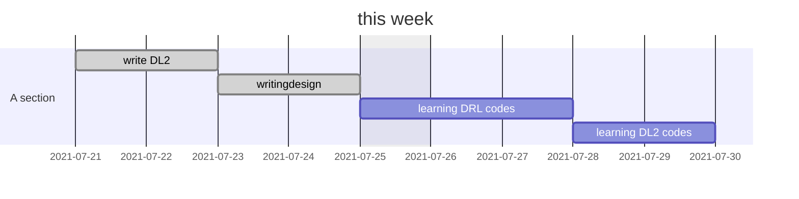

week report 29

## Summary:

### Progress:

1. I 
2. I 

3. I

```mermaid
gantt
dateFormat  YYYY-MM-DD
title this week
excludes weekdays 2021-07-25

section A section
write DL2        :done,   des1,  2021-07-21,2021-07-23
writingdesign               :done, des2,  2021-07-23, 2d
learning DRL codes            :         des3, 2021-07-25, 3d
learning DL2 codes        :         des4, after des3, 2d

```

4. I am writting motivation and background.

  DL2  could  resources  allocation,  but  it  still  use  default placement  policy  in  its  work,  the  placement  of  workers  and PSs can  potentially be decided  by RL  too. Using one  NN to produce  both  resource  allocation  and  placement  decisions  is challenging, mainly because of the significantly larger action space.  RL  using  a  hierarchical  NN  model  might  be  useful in  making  resource  allocation  and  placement  decisions  in  a hierarchical fashion.

  Deep Reinforcement Learning, DRL has played an important role on game AI because games have concrete rewards. On the contrary, there are few rewards, few network update signals and sample inefficiency in practical applications. It is not so easy for agents to know all the elements in Markov Decision Process. Usually, the state transition function and reward function are difficult to estimate, and even the state in the environment may be unknown. At this time, model free learning is needed. Model free learning does not model the real environment. The agent can only perform actions through certain strategies in the real environment, wait for rewards and state migration, and then update the behaviour strategy according to these feedback information. In this way, it iterates repeatedly until the optimal strategy is learned.

Mirhoseini etc\cite{mirhoseini2017device} uses a recurrent neural network policy network to predict the placement of operations in a computational graph, hierarchical model \cite{mirhoseini_hierarchical_2018} could efficiently place computational graphs onto hardware devices, especially in heterogeneous environments with a mixture of CPUs, GPUs, and other computational devices. It is based on data-flow instead of parameter server architecture. However, it cannot solve the following problems: 

{resource allocation} It still use the resources (PS/worker) allocated by TensorFlow or job owner, which are less efficient or not general enough.   

{multiple jobs}  The planner can only optimizes the training time for a target model (e.g., a TensorFlow graph) If we meet another model, we need retrain this planner. Further, the modeling typically does not consider interference in a multi-tenant cluster.  On the contrary, harmony can find the efficient placement of different type of jobs. It is more generic and efficient. 

## day by day

7.29

1. I am trying to implement DL2 by myself. I change its framework to Pytorch for understanding the source codes   

7.30

I have read the introduction of k8s.

