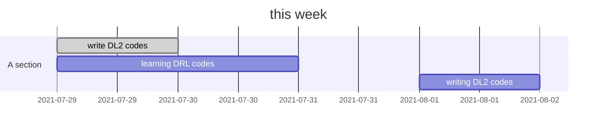

week report 29-08.04

## Summary:

### Progress:

1. 
2. 

3. 

```mermaid
gantt
dateFormat  YYYY-MM-DD
title this week
excludes weekdays 2021-07-25

section A section
write DL2 codes        :done,    2021-07-29,1d
learning DRL codes            :          2021-07-29,2d
writing DL2 codes        :           2021-08-01,1d

```

4. 

## day by day

7.29

1. I am trying to implement DL2 by myself. I change its framework to Pytorch for understanding the source codes.   

7.30

I have read the introduction of k8s.  Online training seems difficult. 

7.31 

I have finished part of the agent.py. I am working with trace class.

8.2
