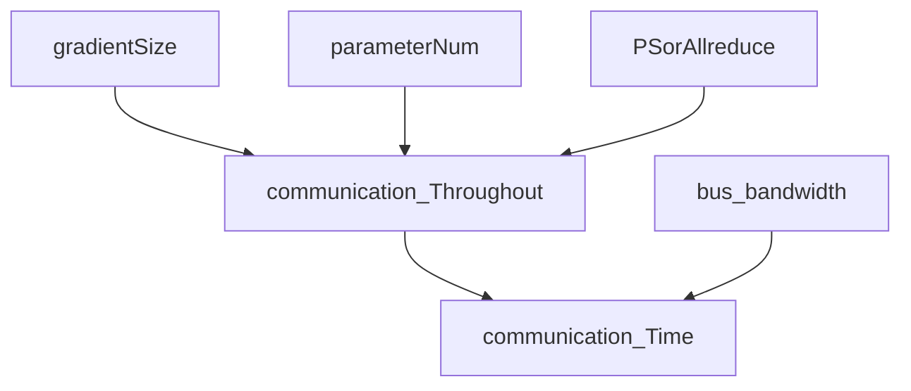

8.12-8.18

## Summary:

### Progress:

I read the paper Pollux about how we could design joint learning.

pollux agent:

1. measure:  the time taken for each iteration of training
2.   calculating the gradient noise scale.
3. fits the system throughput model  to the profiled metrics collected 
4.  reports the fitted system throughput parameters, along with the latest gradient statistics, to PolluxSched.
5.  After reporting to PolluxSched, PolluxAgent updates the job’s per-GPU batch size and gradient accumulation steps, by optimizing its now up-to-date goodput function with its currently allocated resources.

I implement the simulator. I learned how to parser trace. 

I don't have a co-located trace. Ziyue Luo suggested that I could estimate the influence of different placements. 

Firstly, I calculate model size. We only need communicate gradients, one fp32 gradient size is 4 bytes. We multiple it with the number of parameters to gain  communication throughout

model parameters number :

"resnet-50",25 millions

 "vgg-16"138 million

, "resnext-110"

, "inception-bn",   GoogLeNet / *Inception*-v1 : 7 million *parameters* 

"seq2seq", 384M

Secondly, I studied bandwidth,  bandwidth depends on bus.  v100 uses NVLINK2.0  which has 300GB/s bandwidth channels.   PCI-e 3.0 bandwidth = 16GB/s. 

Thirdly, I studied two architecture.

When we use PS architecture,  PS communicates with workers. The bottleneck is often the CPU.  

PS needs to receive all gradients and send all new parameters.  If we have multiple ps, each ps saves partial parameters.
$$
time = throughout /bandwidth \\
throughout= 2 * 4bytes * gradientNum* workerNum \\ 
gradientNum = parameterNum
$$
When we use all-reduce architecture, worker communicate with other workers 

$$
time = throughout /bandwidth = 2*size(θ)*(N-1)/NB \\
size(θ)  = parameterNum * 4bytes \\
throughout= 2*size(θ)*(N-1)/N \\ 
N = workerNum  \\ 
B = bandwidth. \\
$$
