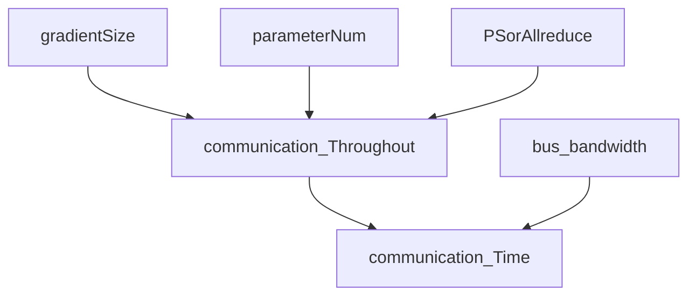

8.12-8.18

## Summary:

### Progress:


day by day

8.12

I read paper Pollux.  I find how we could design joint learning.

8.13

I  try get trace, reproduce pollux 


pollux agent:

1. measure:  the time taken for each iteration of training
2.   calculating the gradient noise scale.
3. fits the system throughput model  to the profiled metrics collected 
4.  reports the fitted system throughput parameters, along with the latest gradient statistics, to PolluxSched.
5.  After reporting to PolluxSched, PolluxAgent updates the job’s per-GPU batch size and gradient accumulation steps, by optimizing its now up-to-date goodput function with its currently allocated resources.

pollux scheduler:

input : 

8.14 

I implement the simulator. I learned how to parser trace.

8.15

I estimate the influence of differnet placement. 


```mermaid
graph 
gradientSize --> communication_Throughout
parameterNum --> communication_Throughout
PSorAllreduce --> communication_Throughout
communication_Throughout --> communication_Time
bus_bandwidth--> communication_Time
```

Firstly, I calculate model size. We only need communicate gradients, one fp32 gradient size is 4 bytes. We multiple it with the number of parameters to gain  communication throughout

model:

["resnet-50",25 millions

 "vgg-16"138 million

, "resnext-110", "inception-bn", "seq2seq", "cnn-text-classification", "dssm", "wlm"]

```py
from keras.applications.resnet50 import ResNet50

resnet_model = ResNet50(weights='imagenet')

#resnet_model.count_params()
resnet_model.summary()
Trainable params: 25,583,592
```


Secondly, I studied bandwidth, 

