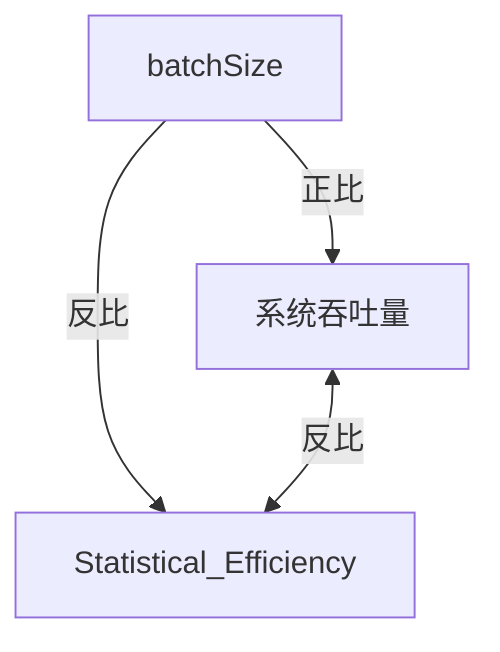

文献综述

其实网络的会议上也有很多做drl的work, 我看今年infocom21 ,  sigcomm应该专门有一个session是ml for network , 20年好像没有相关, 21年的还没出来在 August 24, 2021, 可以看前几年的

**HiPS: Hierarchical Parameter Synchronization in Large-Scale Distributed Machine Learning** NetAI@SIGCOMM 2018

placement

 spotlight和谷歌的, placement 解决的是异构的问题, 用计算图, 我们不是计算图不是异构设备, 是同构下不同job共用PCIe的瓶颈.  这个做的和我们不一样是不能拿来作为论据的.

### Spotlight: Optimizing Device Placement for Training Deep Neural Networks 2018

#### motivation

将神经网络中的每个op最佳地放置在异构设备上很难。 当前最先进的解决方案使用基于策略梯度方法的强化学习(谷歌2017年). 但是效率低下，因为它对每个数据样本执行一次梯度更新（Shulman 等Proximal policy optimization algorithms.，2017） PPO需要建模为MDP.

#### contribution

 Spotlight是一种基于proximal近端策略优化(PPO)的RL算法，专为寻找训练 DNN 的最佳设备放置而设计。 我们新算法的设计依赖于设备放置问题的新模型：通过将其建模为具有多个阶段的马尔可夫决策过程，这是该问题的第一个 MDP 模型。 我们推导出了一个新的性能下限，并证明了一个新的设备放置性能改进定理。 这算法和谷歌大脑是orthogonal 正交的. 谷歌是用策略梯度, 和PPO 算法不一样.

可以改进策略梯度的强化学习, 建模比谷歌的方案快, 而且状态转移模型比谷歌的DRL更稳定.

#### weakness

他可以接受动态来的多个job吗? 还是只能强化学习一个计算图的? 应该也不能优化colocated 多个job的.

### Gandiva: Introspective Cluster Scheduling for Deep Learning 2018osdi18-xiao

[pdf](https://www.usenix.org/system/files/osdi18-xiao.pdf)  

#### motivation

 Gandiva  集群调度框架.   利用时间和空间共享来减少排队延时, 提高资源利用率.
   深度学习的一个关键特征是反馈驱动的探索，用户使用准确性的早期反馈来动态确定或终止一部分作业的优先级 ; 对整个多任务同时进行早期反馈至关重要。 第二个特征是深度学习工作在资源使用方面的异质性， make it hard to achieve best fit a priori.

 传统调度程序运行一部分作业直到完成，同时排队其他作业； 该模型不适合多任务，需要对多任务中的所有任务同时进行早期反馈。 此外，与多任务一起，其他已确定正确超参数的 任务运行数小时到数天，导致线头阻塞 head of line blocking，因为长时间运行的作业在完成之前保持对 GPU 的独占访问，而依赖于早期反馈的多作业在队列中等待。 长排队时间迫使用户要么使用保留的 GPU，要么要求集群超额配置，从而降低集群效率。

其次，作业是异构的，因为它们针对不同的application。 job在内存使用、GPU 核心利用率、对互连带宽的敏感性和/或来自其他作业的干扰方面存在很大差异。 例如，某些多 GPU DLT 作业在使用亲和 GPU 时可能表现得更好，而其他作业可能对亲和性不那么敏感（第 3 节）。 因此，将作业视为黑盒的传统调度程序将实现次优的集群效率

#### contribution

 Gandiva 通过利用深度学习的第三个关键特征来解决这两个挑战：intra-job predictability，因为它们执行称为小批量迭代的大量重复迭代。  Gandiva 利用intra-job predictability在多个作业中有效地对 GPU 进行时间切片，从而提供低延迟。 这种可预测性还用于 introspecting 作业性能并将作业动态迁移到更适合的 GPU，从而提高集群效率。  

In effect, it re-defines the atom of scheduling from a job to automatically partitioned micro-tasks. This enables the cluster to over-subscribe  jobs and provide early feed back through time-slicing to all jobs.

Gandiva 还使用可预测性来执行配置文件驱动的内省。 它使用小批量进度率来持续反思其决策以提高集群效率, 它动态地将通信密集型作业迁移到更多关联的 GPU； 我们目前实施的内省策略是一种有状态的试错策略，由于我们考虑的选项的可预测性和有限的状态空间，它是可行的。

除了本文评估的特定内省和调度策略之外，Gandiva 框架还提供了以下 API：(a) 高效的挂起-恢复或时间切片，(b) 低延迟迁移，(c) 精细- 粒度分析，(d) 动态内部工作弹性，和 (e) 动态优先级。 使这些原语高效实用的关键是 Gandiva 的协同设计方法，它跨越调度程序层和 DLT 工具包层。传统调度器有充分的理由将工作视为黑匣子。 然而，通过利用 GPU 集群的专用特性，Gandiva 为深度学习的特定工作负载定制了调度程序，从而为调度程序提供了对作业的更多可见性和控制，也有通用性。

该论文的主要贡献如下。
   • 我们说明了深度学习workflow的各种独特特征，并将其map集群调度所需的特定要求。
   • 我们确定了作业调度策略可以使用的generic primitives，并提供application-aware技术，通过利用 DL intra-job periodicity，使诸如时间切片(GPU资源分配)和迁移(device placement)之类的原语更加高效和实用.
   • 我们提出并评估了一种新的内省introspective调度框架，该框架利用领域知识不断改进其调度决策，缩短早期反馈时间并提供高集群效率。

我们提出了 Gandiva，一种用于深度学习的集群调度框架，它提供了一组高效的低级系统原语，例如时间切片、迁移、作业内弹性和动态优先级。 使用这些原语，Gandiva 可以有效地支持多任务中的NN探索，与在现实的共享集群环境中使用传统调度程序快.  Gandiva 通过利用 作业内可预测性提供了所提议机制的有效实现：我们的系统原型表明，pytorch,tf这些跨服务器迁移，也可以在一秒钟内实现作业暂停/恢复和迁移.

#### weakness

(在下面的这篇论文[异构aware](#Heterogeneity-Aware Cluster Scheduling Policies for Deep Learning Workloads  osdiNov2020)中的related work讲的)

没有指定明确的调度策略, 也不支持可配置的目标.   使用基于分析的方法来确定是否在加速器上co-locate jobs. 但是, 没有把 model performance data(isolated or co-located performance) 明确地纳入其调度策略. 而是对作业组合随机探索直到找到可以提高性能的组合. 

在(论文[pollux](#Pollux: Co-adaptive Cluster Scheduling for Goodput-Optimized Deep Learning osdi2021)说 ) , 要求用户提交GPU数量,   属于non-scale-adaptive 调度. 通过 细粒度 time sharing和 job packing 提高资源利用率. 尽管 Gandiva 可能会动态地更改作业使用的 GPU 数量，但它是随机性的，而不是基于作业可扩展性的知识. 

Gandiva [8] 通过在运行时动态改变分布式深度学习作业的 GPU 使用模式，加速反馈驱动探索中的 DL 模型训练。 它可以减少早期反馈延迟并提高 GPU 集群中的调度效率。 但是，这种方法会干扰 intrusive DL 训练框架。 

### Heterogeneity-Aware Cluster Scheduling Policies for Deep Learning Workloads  osdiNov2020

[pdf](https://www.usenix.org/system/files/osdi20-narayanan_deepak.pdf)   [slides](https://www.usenix.org/sites/default/files/conference/protected-files/osdi20_slides_narayanan.pdf)   [code ](https://github.com/stanford-futuredata/gavel) Narayanan et al 

#### motivation

现在很多调度方法没有考虑heterogeneous 的设备. AlloX和Gandivafair only work for 单个policy. 传统调度器 没有考虑job在不同设备上的不同表现.

#### contribution

提出有效吞吐量, 把一些 已有的调度策略表示为有效吞吐量方面的优化问题. 

gravel 用基于轮次 round-based 调度, 是一种将现有集群调度策略转换为考虑异质性和colocation的等效策略的系统方法.
   • 基于轮次的调度机制，确保集群实现这些策略的分配。
   • 我们框架概括许多现有policy，以改进相应的目标. 而且支持多级fairness.

schedule机制, 输入 所有active job的组合, 总worker的个数. 

#### weakness

但是他们并未在这项工作中提出新的调度策略或性能优化。 相反，Gavel 的主要目标是确定如何最好地以异构感知方式在许多不同用户和作业之间共享资源，同时支持许多现有的集群范围的目标。  Gavel 通过一个策略框架来实现这些目标，该框架可以轻松地使策略具有异质性、托管和放置感知 (§4)、可重用的调度机制 (§5) 以及允许用户以最少的代码更改部署他们的应用程序（第 6 节） 或许这可以作为一个baseline 或者是让设备放置网络先收敛到这个指定的策略. 可以参考它的feedback

#### idea: 

 这个策略分配是他自己计算的吗? 可不可以用DRL 作为它的policy 输出? 我觉得好像行不通, 他是有个矩阵, 然后矩阵最大化吞吐量 . 策略都要要用线性函数来表示 来吞吐量.  需要能线性建模才行 ,DRL 不能线性建模

输入 :每个device上每个job的性能 . 用户提供或者吞吐量估算器测量

输出: 异构-aware policy 计算出每个job的运行时间,  给每个资源授予job时间, 在worker之间移动job.(我们是给每个job分配资源, 然后放置

### Pollux: Co-adaptive Cluster Scheduling for Goodput-Optimized Deep Learning osdi2021

[pdf](https://arxiv.org/pdf/2008.12260.pdf)    [code](https://github.com/petuum/adaptdl)   [slides](https://www.usenix.org/system/files/osdi21_slides_qiao.pdf)

#### motivation

GPU多了就不会提升训练速度.统计表明 batch size 过大, 需要的step会变多.  而且模型泛化性变差. 但是最优的batch size 不是不变的, 训练时还会改变. 

batch size  取决于 scalablity和 statistical efficiency统计效率. 统计效率通常和throughput 成反比. 

目前的调度器选了资源, 但是对batch size和学习率没有相应调整. 这些超参数还和资源互相依赖.    

How can a cluster scheduler help to automatically configure user-submitted DL jobs?

#### contribution

考虑了多个job,在训练期间监控每个作业的状态，Pollux 模拟了它们的 Goodput（我们引入的将系统吞吐量与statistical efficiency相结合的指标）将如何通过adding or removing资源而改变。  Pollux 动态(重新)assign资源以提高cluster-wide的goodput，同时尊重公平性并不断优化每个 DL 作业以更好地利用这些资源.

吞吐量:=单位时间训练样本数. 受资源分配和placement的影响, 受同步或者异步影响 , 受batch size 影响

统计效率 :=单位样本数取得的训练进展,这受超参数比如学习率和batch size 有关.如果统计效率预测的准,及时调整就可以提高统计效率

#### weakness

她没有考虑device placement

#### idea

现有的调度器对 DL 训练的统计效率以及资源决策和训练参数的相互依赖性是不可知的。  Pollux 明确地共同调整这些相互依赖的值，以提高 DL 作业的吞吐量. 目前我们对resource allocation和 placement也是不可知的, 所以我们需要共同调整. 

他是怎么共同调整的?

两个粒度, job 粒度 和cluster粒度.  pollux agent 拟合效率和吞吐量,  报告给scheduler, scheduler 定期根据每个job和总体cluster优化资源分配 . 也考虑了重分配的网络开销.  每个job的agent 报告goodputs, scheduler 动态分配资源. 

scheduler的工作: 分配资源, 考虑agent tune的能力, 

job agent的工作:  调整超参数, 

遗传算法. 来调整策略. 我们可不可以用DRL?

怎么测量goodput?  replica

怎么预测goodput?  用一个方程来估计效率.

怎么配合job的colocation 和单个job的performance?

第二层的决策怎么给第一层一些影响?怎么设计一个function,作为我们drl的目标,可以jointly的平衡这两个问题single job performance & cluster performance?

### Grouper: Accelerating Hyperparameter Searching in Deep Learning Clusters With Network Scheduling  2020

[pdf](https://ieeexplore.ieee.org/stamp/stamp.jsp?tp=&arnumber=9075260)

#### motivation

#### contribution

#### weakness

#### idea

感觉这个应该和我们的没啥关系.

### Balancing efficiency and fairness in heterogeneous GPU clusters for deep learning EuroSys 2020

[pdf](https://dl.acm.org/doi/abs/10.1145/3342195.3387555)     [slides](https://www.eurosys2020.org/wp-content/uploads/2020/04/slides/607_chaudhary_slides.pdf)  [video](https://youtu.be/Ck9JesVXNl8)

#### motivation

How to share a large cluster among  many different groups? 比如MSR也要用, bing 组也要用, 生产也要用. 

• How to choose the best GPU automatically?

#### contribution

考虑了worker和model的异质性. 

 用户被分配tickets，GPU 吞吐量按比例分配给所有活跃用户。
   • tickets在同一用户的所有作业之间平均分配。
   • 作业可以有不同的大小，GPU 应该是成组调度gang-scheduled的。
   • 我们使用 Gandiva5 中实现的时间切片和迁移原语

分步调度.

#### weakness

Gandivafair(在上面的这篇论文[异构aware](#Heterogeneity-Aware Cluster Scheduling Policies for Deep Learning Workloads  osdiNov2020)中的related work讲的) 只适合max-min fairness , 用 second-price auction 机制,提高heterogeneity-agnostic max-min fairness scheme, 不保证最终分配的最优.

#### idea

### TicTac: Accelerating Distributed Deep Learning with Communication Scheduling 2018

#### motivation

#### contribution

 P3 [43]、TicTac [44] 和 ByteScheduler [6] 改变了不同 DNN 层的传输顺序，以减少 PS 架构中的通信开销。

#### weakness

#### idea

### Tiresias: A GPU Cluster Manager for Distributed Deep Learning nsdi 2019

[pdf](https://www.usenix.org/system/files/nsdi19-gu.pdf)   [slide](https://www.usenix.org/sites/default/files/conference/protected-files/nsdi19_slides_gu.pdf)   [simulator](https://github.com/SymbioticLab/Tiresias)

#### motivation

1. 不知道要执行多久,想要预测时间. optimus可以预测, 但是很多case 不行. 因为生产环境中job 不一定 loss curve 收敛,  也不一定一直重复执行到完成.
2. over-aggressive job 合并 , 因为网络开销大,  合并了放一个machine上训练快.  但是有时候找不到4台完全空闲的服务器就会把job阻塞掉. 阻塞掉比网络开销更不好. (所以他和我们的还是不一样, 他没有考虑colocated的干扰. )   [Gandiva](#Gandiva: Introspective Cluster Scheduling for Deep Learning 2018osdi18-xiao) 利用time-sharing 解决不可预测的训练时间, 用trial and error 解决合并问题. 但是假设不一定有效. 

#### contribution

1. 对于GPU资源配置,  研发了age-based scheduler Minimize JCT without  complete knowledge of jobs. 利用  least-attained service  把最短执行时间的放最前面,Gittins Index policy 把最大可能最先完成的放最前面.   综合起来是一个离散 2 dimension age-based scheduler(2DAS).  它处理将 GPU 分配给单个作业（即job placement）和随时间调度多个作业。
2. 对于placement, 研发了Model Profile-Based Placement Place jobs without additional  information from users.  tensor大小skewed偏移的时候要合并
3. 不依赖loss和框架细节, 比gandiva快.  Tiresias  是一个 GPU 集群资源管理器，它基于微软集群 Philly [4] 的特性研究，最大限度地减少作业完成时间.

#### weakness

(在上面的这篇论文[异构aware](#Heterogeneity-Aware Cluster Scheduling Policies for Deep Learning Workloads  osdiNov2020)中的related work讲的) 没有将job 对不同加速器的affinities 亲和力纳入其调度目标, 而且调度机制和target policy 强耦合, 很难支持其他更复杂的策略, 如多级公平.

Tiresias [28] and Themis [40] use different objectives to achieve multi-job fairness. However, both do not incorporate jobs’ affinities for different accelerator types in their scheduling objectives, and have scheduling mechanisms strongly coupled with the target policy, making it hard to support other more sophisticated policies like multi-level fairness.

上面论文 [pollux](#Pollux: Co-adaptive Cluster Scheduling for Goodput-Optimized Deep Learning osdi2021)说 ) , 要求用户提交GPU数量, 属于non-scale-adaptive调度. First, non-scale-adaptive schedulers are agnostic无关 to the performance scalability of DL jobs with respect to the amount of allocated resources. For example, Tiresias [22] requires users to specify the number of GPUs at the time of job submission, which will be fixed for the lifetime of the job.

### An Efficient and Non-Intrusive GPU Scheduling Framework for Deep Learning Training Systems 2020

[pdf](https://ieeexplore.ieee.org/stamp/stamp.jsp?tp=&arnumber=9355203)   

#### motivation

 DL 训练调度器通常为每个作业分配固定数量的 GPU，这会抑制高资源利用率并通常会延长整体训练时间。 最近引入的可以动态重新分配 GPU 的调度程序实现了更好的集群效率。 然而，这种动态特性会通过终止和重新启动作业或需要修改 DL 训练框架而引入额外的开销。

#### contribution

​    我们提出并开发了一种高效、非侵入性的 GPU 调度框架，该框架结合了自适应 GPU 调度程序和弹性 GPU 分配机制.  具体来说，自适应 GPU 调度程序包括一个调度算法，该算法使用训练作业进度信息来确定在任何给定时间为传入和运行作业的 GPU 的最有效分配和重新分配。 弹性 GPU 分配机制与调度程序协同工作。 它提供了一种轻量级且非侵入性的方法来基于“SideCar”进程重新分配 GPU，该进程使用不同数量的 GPU 临时停止和重新启动作业的 DL 训练过程。

 别的方法优化了单个分布式 DL 作业的训练，而我们的调度框架优化了多个分布式 DL 作业的 GPU 调度。

调度框架可以不终止工作,包括一个弹性的 GPU 分配机制，以进一步减少reshape的开销。

#### weakness

#### idea

这个可以看看她是怎么停止GPU的, 因为我们的DRL也需要停止GPU和启动GPU.训练作业进度信息来确定在任何给定时间为传入和运行作业的 GPU 的最有效分配和重新分配.输入输出应该都是一样的.也可以做non-intrusive.

### E-LAS: Design and Analysis of Completion-Time Agnostic Scheduling for Distributed Deep Learning Cluster 2020

#### motivation

#### contribution

#### weakness

#### idea

### Themis: Fair and Efficient GPU Cluster Scheduling  nsdi2020

[pdf](https://www.usenix.org/system/files/nsdi20-paper-mahajan.pdf) [slide](https://www.usenix.org/sites/default/files/conference/protected-files/nsdi20_slides_mahajan.pdf)

#### motivation

一个关键问题是如何在工作负载之间公平地分配 GPU, 我们发现，由于 ML 工作负载的独特属性，已建立的集群调度规则并不适合：ML 作业具有需要进行组调度的长时间运行的任务，并且它们的性能对任务的相对位置很敏感。 目前的调度器,  short apps没有sharing incentive(SI). 短apps要等很久(感觉这是一个重要问题, 许多论文都有提到)  所以需要抢占.

device  ,有的模型需要dense placement.

 Themis 提出了一个新的度量metric完成时间公平性，它捕获了 SI

#### contribution

 Themis, 一种用于 ML 训练工作负载的新调度框架。 它的 GPU 分配策略强制 ML 工作负载以公平的方式完成，这是我们引入的一个新概念。 为了捕捉位置敏感性并确保效率，Themis 使用了一种两级调度架构，其中 ML 工作负载竞标由中央仲裁器运行的拍卖bid中提供的可用资源。 我们的拍卖设计通过在短期内权衡公平性和效率来分配 GPU 以赢得竞标，但从长远来看确保完成时间的公平性。 引入了完成时间公平的概念，并通过两级调度架构促进了多个 DL 应用程序之间的公平。

GPU的合并 = >   sharing incentive is key

#### weakness

(在上面的这篇论文[异构aware](#Heterogeneity-Aware Cluster Scheduling Policies for Deep Learning Workloads  osdiNov2020)中的related work讲的) 没有将job 对不同加速器的affinities 亲和力纳入其调度目标(没有考虑异构), 而且调度机制和target policy 强耦合, 很难支持其他更复杂的策略, 如多级公平.

### **AlloX: Compute Allocation in Hybrid Clusters EUROSYS20**

现代深度学习框架支持各种硬件（包括 CPU、GPU 和其他加速器）来执行计算。 在本文中，我们研究了如何在此类可互换资源（每个资源具有不同的计算速率）上调度作业，以优化性能，同时在共享集群中的用户之间提供公平性。 我们从理论上和经验上证明，现有解决方案及其直接修改在存在可互换资源的情况下表现不佳，这激发了 AlloX 的设计和实现。  AlloX 的核心是将调度问题转化为最小成本二分匹配问题，并提供随时间动态的公平分配。
